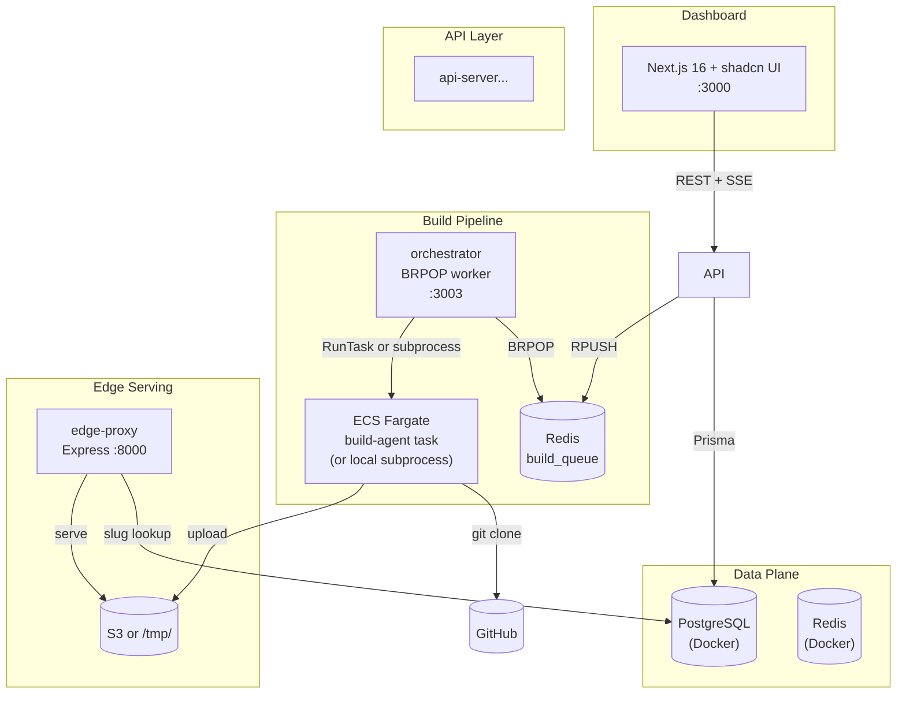

# DeployIt

Deploy your frontend effortlessly.DeployIt is a static site hosting platform where users
authenticate with GitHub, import repositories, build them on AWS ECS
Fargate, and serve the generated static artifacts from Amazon S3.

## Architecture



# Quick Start

### 1. Install Dependencies & Setup Environment

```bash
# Install root dependencies
bun install

# Configure environment variables
cp .env.example .env
# Edit .env and fill in required GitHub OAuth & AWS credentials

# Symlink .env to all individual services
for svc in api-server orchestrator build-agent edge-proxy dashboard; do
  ln -sf ../.env $svc/.env
done
```

---

## Step 2: Run AWS Setup Script

The `scripts/setup-aws.sh` script creates all necessary AWS resources.

```bash
cd /home/rishisulakhe/projects/vercel

# Make sure you're logged in
aws sts get-caller-identity

# Run the setup script
./scripts/setup-aws.sh
```

**What the script creates:**

| Resource | Purpose | Cost |
|----------|---------|------|
| S3 Bucket | Store build artifacts | ~$0.01/GB/month |
| ECR Repository | Store build-agent Docker image | ~$0.10/GB/month |
| ECS Cluster | Orchestrate build tasks | $0 (Fargate pay-per-task) |
| IAM Task Execution Role | Allow ECS to pull images | Free |
| IAM Task Role | Allow build-agent to write to S3 | Free |
| ECS Task Definition | Define build-agent container config | Free |
| CloudWatch Log Group | Store build logs | ~$0.50/GB |

---

## Step 3: Update .env File

Create/update your `.env` file:

```bash
cp .env.example .env
```

Edit `.env` and ensure these are set:

```bash
# --- GitHub OAuth ---
GITHUB_CLIENT_ID="Ov23liLuiYXJ3T4h87rX"
GITHUB_CLIENT_SECRET="72c1b2b89c687a1b6ce0c6dcf653d2bd18f927dd"
NEXT_PUBLIC_GITHUB_CLIENT_ID="Ov23liLuiYXJ3T4h87rX"
NEXT_PUBLIC_GITHUB_REDIRECT_URI="http://localhost:3000/api/auth/callback/github"
GITHUB_REDIRECT_URI="http://localhost:3000/api/auth/callback/github"
NEXTAUTH_SECRET="bjeOoKTmIIMEmTGch06kUpDVt++uG5T+4xFs1lV2grw="

# --- AWS (from setup-aws.sh output) ---
AWS_REGION="ap-south-2"
S3_ARTIFACTS_BUCKET="deployit-rishi-artifacts"
ECS_CLUSTER="vercel-clone"
ECS_BUILD_TASK_DEFINITION="vercel-clone-build-agent"
ECS_BUILD_TASK_SUBNETS="subnet-aaa,subnet-bbb"
ECS_BUILD_TASK_SECURITY_GROUPS="sg-ccc"
```

**Important:** Keep these as-is for AWS mode:
```bash
S3_ARTIFACTS_BUCKET="deployit-rishi-artifacts"  # NOT "local"
ECS_BUILD_TASK_SUBNETS="subnet-xxx"           # NOT empty
EDGE_PROXY_BACKEND_BASE_URL=""                 # empty = serve from S3 directly
```

---


### 4. Build & Push Build Agent to Amazon ECR

```bash
# Authenticate Docker with ECR
aws ecr get-login-password --region "$AWS_REGION" | \
  docker login --username AWS --password-stdin "$(echo "$ECR_URI" | cut -d/ -f1)"

# Build and push the container image
cd build-agent
docker build -t "$ECR_URI:latest" .
docker push "$ECR_URI:latest"
cd ..
```

---

### 5. Start Backing Services & Migrate Database

```bash
# Start PostgreSQL, Redis, Prometheus, and Grafana
docker compose up -d

# Generate Prisma client and apply database migrations
cd api-server
bunx prisma generate --schema=prisma/schema.prisma
bunx prisma migrate deploy --schema=prisma/schema.prisma
cd ..
```

---

### 6. Start Application Services

Run each command in a separate terminal:

```bash
bun run dev:api        # API Server:     http://localhost:3001
bun run dev:orch       # Orchestrator:   http://localhost:3003
bun run dev:proxy      # Edge Proxy:     http://localhost:8000
bun run dev:dashboard  # Dashboard:      http://localhost:3000
```

---

### 7. Access the Platform

* **Dashboard:** [http://localhost:3000](http://localhost:3000) (Sign in with GitHub and deploy a repository)
* **Deployed Sites:** `http://localhost:8000/<project-slug>/`

## Services

| Package | Runtime | Port | Role |
|---|---|---|---|
| `dashboard/` | Node 22 | 3000 | Next.js 16 + shadcn UI, GitHub OAuth, SSE logs |
| `api-server/` | Bun | 3001 | Hono REST API + Prisma |
| `orchestrator/` | Bun | 3003 | Redis BRPOP → ECS/subprocess dispatcher |
| `build-agent/` | Bun | — | git clone → build → S3 upload |
| `edge-proxy/` | Bun | 8000 | Subdomain/path routing → S3 filesystem |

## Documentation

| Document | Description |
|---|---|---|
| [docs/architecture.md](docs/architecture.md) | System design, data flow, decision log |
| [docs/runbooks/local-dev.md](docs/runbooks/local-dev.md) | Development setup, troubleshooting |
| [docs/aws-deployment-guide.md](docs/aws-deployment-guide.md) | **Complete AWS setup guide** |
| [docs/runbooks/deploy-project.md](docs/runbooks/deploy-project.md) | Deploying via UI or API |
| [docs/runbooks/secrets.md](docs/runbooks/secrets.md) | GitHub OAuth setup |
| [docs/runbooks/troubleshooting.md](docs/runbooks/troubleshooting.md) | Common issues |


## Summary

This project provides a Vercel-style deployment workflow with a local
application control plane and AWS-powered build infrastructure.

```text
                  LOCAL
┌───────────────────────────────────┐
│ Dashboard                         │
│    ↓                              │
│ API ─────→ PostgreSQL             │
│  │                                │
│  └────→ Redis → Orchestrator ─────┼──── AWS
│                                   │      │
│ Edge Proxy ←───────────────────────┼── S3 │
└───────────────────────────────────┘      │
                                           │
                                    ECS Fargate
                                           │
                                      build-agent
                                           │
                                      GitHub + ECR
```


## License

MIT.
