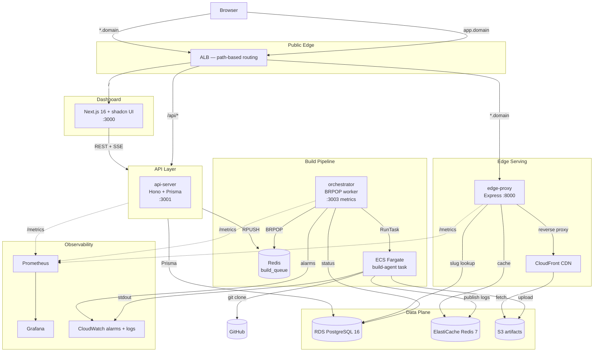

# Vercel Clone (on AWS)

A self-hosted, Vercel-style static site hosting platform. Users authenticate
with GitHub, import a repository, and have it built and served on a subdomain.
The build backend runs as **AWS ECS Fargate** tasks, artifacts are stored in
**S3 + CloudFront**, the queue/cache uses **ElastiCache Redis**, and the
database is **RDS PostgreSQL**. The whole cloud layer is provisioned with
**Terraform**.

> Built as a DevOps role interview project, improving on the Azure-based
> reference project [DeployIt](https://github.com/...) — see
> [docs/architecture.md](docs/architecture.md#comparison-with-deployit) for
> a full comparison.

## Two modes

This project works in **two modes** — you switch between them by changing
values in `.env` (no code changes needed):

| | Local-only mode | AWS mode |
|---|---|---|
| Terraform | Not required | `terraform apply` |
| Builds | Run as local subprocesses | Run on ECS Fargate |
| Artifacts | `/tmp/vercel-clone-artifacts/` | Real S3 bucket |
| Serving | edge-proxy reads from filesystem | edge-proxy → CloudFront → S3 |
| Queue/Logs | Local docker Redis | Local Redis (queue) + ElastiCache (logs) |
| Cost | $0 | ~$3-5/day |
| When to use | Development, demos, interviews | Full end-to-end testing |

**Switch to AWS mode** — see [AWS mode setup](#aws-mode-optional) below.

## Architecture



See **[docs/architecture.md](docs/architecture.md)** for the full system design,
data flow, security model, and decision log.

## Services (Bun workspace monorepo)

| Package | Runtime | Stack | Port | Role |
|---|---|---|---|---|
| `dashboard/` | Node 22 | Next.js 16, React 19, shadcn UI | 3000 | Web UI, GitHub OAuth callback, SSE log viewer |
| `api-server/` | Bun | Hono + Prisma 6 + RDS | 3001 | REST API + SSE: auth, projects, deployments, env vars |
| `orchestrator/` | Bun | AWS ECS SDK | 3003 | BRPOP queue → ECS RunTask → retry/DLQ → status updates |
| `build-agent/` | Bun | Docker image (Fargate task) | — | git clone → detect PM → build → S3 upload → Redis logs |
| `edge-proxy/` | Bun | Express 5 + http-proxy | 8000 | subdomain/path → RDS lookup → CloudFront/local serving |

## Quick start (local-only mode)

This is the default — no AWS, no Terraform, zero cost.

### Prerequisites

- [Bun](https://bun.sh) 1.3+
- [Docker](https://docker.com) + Docker Compose
- A GitHub OAuth App (Settings → Developer settings → OAuth Apps → New OAuth App)
  - Homepage URL: `http://localhost:3000`
  - Callback URL: `http://localhost:3000/api/auth/callback/github`

### Setup

```bash
# 1. Install all workspace dependencies
bun install

# 2. Copy the env template and fill in GitHub OAuth values
cp .env.example .env
# Edit .env — fill in GITHUB_CLIENT_ID, GITHUB_CLIENT_SECRET,
#   NEXT_PUBLIC_GITHUB_CLIENT_ID, NEXTAUTH_SECRET
# In local mode these stay as-is: S3_ARTIFACTS_BUCKET="local",
#   ECS_BUILD_TASK_SUBNETS="", EDGE_PROXY_BACKEND_BASE_URL=""

# 3. Symlink .env into each service directory (Bun loads .env from CWD)
for svc in api-server orchestrator build-agent edge-proxy dashboard; do
  ln -sf ../.env $svc/.env
done

# 4. Start backing services
docker-compose up -d   # postgres + redis + prometheus + grafana

# 5. Generate Prisma client + run migrations
cd api-server
bunx prisma generate --schema=prisma/schema.prisma
bunx prisma migrate deploy --schema=prisma/schema.prisma
cd ..

# 6. Start all app services (each in its own terminal)
bun run dev:api        # api-server on :3001
bun run dev:orch       # orchestrator on :3003
bun run dev:proxy      # edge-proxy on :8000
bun run dev:dashboard  # Next.js on :3000
```

### Deploy a project

1. Open http://localhost:3000 → sign in with GitHub
2. Click **New Project** → pick a repo → configure build settings → **Deploy**
3. Watch build logs (SSE stream) — or check the orchestrator terminal
4. Once status = `SUCCESS`, click **Visit** → opens `http://localhost:8000/<slug>/`
5. The edge-proxy serves the build output from `/tmp/vercel-clone-artifacts/`

### Service URLs

| Service | URL |
|---|---|
| Dashboard | http://localhost:3000 |
| api-server | http://localhost:3001/healthz |
| Orchestrator metrics | http://localhost:3003/metrics |
| Edge proxy | http://localhost:8000/healthz |
| Deployed site | http://localhost:8000/`<slug>`/ |
| Grafana | http://localhost:3002 (admin/admin) |
| Prometheus | http://localhost:9090 |

### Stopping

```bash
# Stop app services (Ctrl+C in each terminal)
docker-compose down      # stop containers, keep data
docker-compose down -v   # stop + wipe Postgres/Redis data
```

## AWS mode (optional)

When you want real ECS Fargate builds, real S3 uploads, and CloudFront CDN
serving, provision the AWS infrastructure with Terraform.

### When to use AWS mode

- Full end-to-end testing of the build pipeline
- Demo on real cloud infrastructure
- Interview presentation showing IaC + serverless builds
- **Cost: ~$3-5/day** (NAT gateway + RDS t4g.micro + ElastiCache t4g.micro + ALB)

### When to destroy

- When done testing for the day
- Over weekends/nights when not needed
- You can re-apply in ~10 minutes when you need it again

### Step 1: Provision AWS infrastructure

```bash
cd infra/terraform

# One-time: create S3 state bucket + DynamoDB lock table
# (skip if already done)
aws s3api create-bucket --bucket vercel-clone-tfstate \
  --region ap-south-2 \
  --create-bucket-configuration LocationConstraint=ap-south-2
aws s3api put-bucket-versioning --bucket vercel-clone-tfstate \
  --versioning-configuration Status=Enabled
aws dynamodb create-table --table-name vercel-clone-tfstate-lock \
  --attribute-definitions AttributeName=LockID,AttributeType=S \
  --key-schema AttributeName=LockID,KeyType=HASH \
  --billing-mode PAY_PER_REQUEST --region ap-south-2

# Initialize Terraform
terraform init

# Provision everything (~10 min)
terraform apply -auto-approve
```

### Step 2: Build & push the build-agent Docker image to ECR

```bash
# Get the ECR URI
ECR_URI=$(terraform output -raw ecr_repository_urls | jq -r '."build-agent"')

# Login to ECR
aws ecr get-login-password --region ap-south-2 | \
  docker login --username AWS --password-stdin \
  297155701257.dkr.ecr.ap-south-2.amazonaws.com

# Build & push
cd build-agent
docker build -t $ECR_URI:latest .
docker push $ECR_URI:latest
cd ..
```

### Step 3: Update .env with Terraform outputs

```bash
cd infra/terraform

# Capture all outputs
terraform output -json > /tmp/tfout.json

# Update .env with these values:
#   S3_ARTIFACTS_BUCKET     ← s3_artifacts_bucket_name
#   CLOUDFRONT_DOMAIN       ← cloudfront_distribution_domain
#   ECS_BUILD_TASK_SUBNETS  ← private_subnet_ids (comma-separated)
#   ECS_BUILD_TASK_SECURITY_GROUPS ← (from AWS console or terraform)
#   KMS_KEY_ID              ← kms_key_id
#   EDGE_PROXY_BACKEND_BASE_URL ← "https://<CLOUDFRONT_DOMAIN>"
#   ECS_REDIS_URL           ← "redis://<redis_endpoint>:6379"
```

### Step 4: Restart services

```bash
# Kill all running services, then restart:
bun run dev:api
bun run dev:orch      # now dispatches to real ECS Fargate
bun run dev:proxy     # now proxies to real CloudFront
bun run dev:dashboard
```

### What changes in AWS mode

| Component | Local mode | AWS mode |
|---|---|---|
| Build execution | `bun src/index.ts` subprocess | ECS Fargate task (serverless) |
| Artifact storage | `/tmp/vercel-clone-artifacts/` | S3 bucket (`vercel-clone-dev-artifacts`) |
| Serving | edge-proxy reads from filesystem | edge-proxy → CloudFront → S3 |
| KMS encryption | Passthrough (dev: prefix) | Real KMS encrypt/decrypt |
| Build logs | Local Redis pub/sub | ElastiCache Redis pub/sub |
| Build dispatch | No subprocess overhead | ECS RunTask API call |

### Destroying AWS infrastructure

**Important:** Run this when you're done testing to avoid charges.

```bash
cd infra/terraform
terraform destroy -auto-approve

# Optionally clean up the state bucket + lock table:
aws s3 rb s3://vercel-clone-tfstate --force
aws dynamodb delete-table --table-name vercel-clone-tfstate-lock --region ap-south-2
```

After destroying, switch `.env` back to local mode:
```
S3_ARTIFACTS_BUCKET="local"
ECS_BUILD_TASK_SUBNETS=""
EDGE_PROXY_BACKEND_BASE_URL=""
CLOUDFRONT_DOMAIN=""
KMS_KEY_ID=""
ECS_REDIS_URL=""
```

Restart services and you're back in local-only mode.

## AWS infrastructure (Terraform)

All cloud resources in `infra/terraform/`, provisioned via 10 modular Terraform
modules. Region: `ap-south-2` (Hyderabad).

| Module | Resources |
|---|---|
| `vpc` | VPC, 2-AZ public+private subnets, IGW, NAT GW |
| `kms` | Customer-managed CMK (S3 SSE + app secrets + RDS + ECR) |
| `s3` | Artifacts bucket (versioned, SSE-KMS, block-public, lifecycle) |
| `cloudfront` | CDN distribution with OAC, SPA fallback, PriceClass_200 |
| `rds` | PostgreSQL 16 (Single-AZ dev / Multi-AZ prod) |
| `elasticache` | Redis 7 (single-node dev / cluster-mode prod) |
| `ecr` | 5 repos with lifecycle policies |
| `ecs` | Fargate cluster + build-agent task definition + IAM roles |
| `alb` | ALB with HTTP listener (dev) / HTTPS redirect (prod), 3 target groups |
| `cloudwatch` | Log groups per service + 7 metric alarms + SNS alert topic |

Workspaces: `dev` (single-AZ, no TLS) and `prod` (Multi-AZ RDS, Redis cluster,
ACM wildcard cert, Route53 records).

See **[docs/runbooks/terraform.md](docs/runbooks/terraform.md)** for full
provisioning instructions.

## Documentation

| Document | Description |
|---|---|
| [docs/architecture.md](docs/architecture.md) | System design, Mermaid diagram, data flow, security model, decision log, DeployIt comparison |
| [docs/runbooks/local-dev.md](docs/runbooks/local-dev.md) | Local development setup, Grafana dashboards, troubleshooting |
| [docs/runbooks/terraform.md](docs/runbooks/terraform.md) | AWS provisioning, workspaces, CI/CD integration, teardown |
| [docs/runbooks/deploy-project.md](docs/runbooks/deploy-project.md) | Deploying a project via UI or API, build lifecycle |
| [docs/runbooks/secrets.md](docs/runbooks/secrets.md) | GitHub OAuth, KMS encryption, AWS credentials, SNS alerts |
| [docs/runbooks/troubleshooting.md](docs/runbooks/troubleshooting.md) | Service startup, build pipeline, database, Redis, observability |

## Project phases

| Phase | Commit | Description |
|---|---|---|
| 0 | `09c1c5a` | Repo reorg — Bun workspace monorepo, directory renames, stubs |
| 1 | `c5d92b2` | Terraform infra (10 modules) + docker-compose for local dev |
| 2 | `bbe8ebc` | Backend — all 4 services (api-server, orchestrator, build-agent, edge-proxy) |
| 3 | `86d2ae0` | Frontend — Next.js 16 + shadcn UI, GitHub OAuth, SSE logs |
| 4 | `2efc852` | Observability — Grafana dashboards, Prometheus rules, CloudWatch alarms |
| 5 | `efd220b` | CI/CD — GitHub Actions (lint/test, terraform plan, build-push to ECR) |
| 6 | `25839fd` | Docs + runbooks — architecture, decision log, 5 runbooks |

## Key improvements over DeployIt

| | DeployIt | Vercel Clone |
|---|---|---|
| Cloud | Azure (manual) | AWS (Terraform IaC) |
| Build agent | Single Docker host (dockerode) | AWS ECS Fargate (serverless) |
| Build retries | None | 3× with dead-letter queue |
| Package manager | npm only | Auto-detect pnpm/yarn/npm |
| Secrets | Plaintext in DB | KMS-encrypted at rest |
| Live logs | Polling (5s interval) | SSE (real-time) |
| Backend | Bundled in Next.js | Separate Hono api-server |
| IaC | None | Terraform (10 modules, 2 workspaces) |
| Observability | None | Prometheus + Grafana + CloudWatch alarms |
| CDN | Direct S3 proxy | CloudFront + OAC |
| Local dev | Not supported | Full local mode (no AWS needed) |

## Security note

An Upstash Redis password was committed to git history in an early commit
(`30f24a0`). It has been removed from the current codebase, but the history
still contains it. See
[docs/runbooks/secrets.md](docs/runbooks/secrets.md#rotating-the-upstash-redis-password-from-the-original-build-server)
for rotation instructions before making the repo public.

## License

MIT.