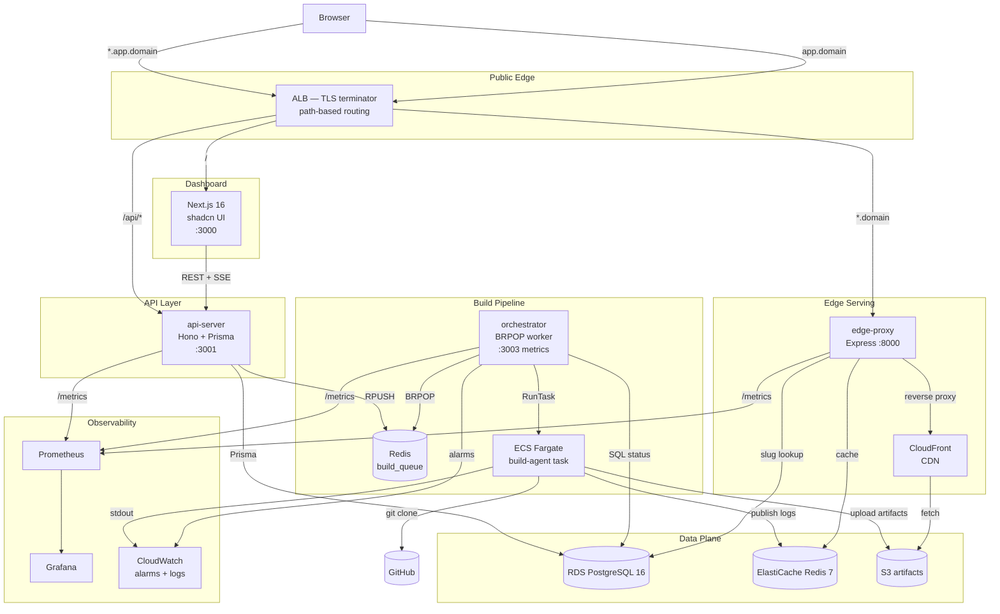
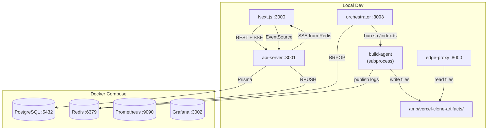

# Architecture

## Overview

A self-hosted Vercel-style static site deployment platform on AWS. Users sign
in with GitHub, import a repository, and the platform builds it as an ECS
Fargate task, stores the artifacts in S3 (behind CloudFront), and serves them
on a subdomain via a reverse proxy.

The platform supports **two modes** — local-only (no AWS) and full AWS —
switchable via `.env` values with no code changes.

## Two Modes

| | Local-only mode | AWS mode |
|---|---|---|
| Builds | `bun src/index.ts` subprocess | ECS Fargate task (serverless) |
| Artifacts | `/tmp/vercel-clone-artifacts/` | S3 bucket (`vercel-clone-dev-artifacts`) |
| Serving | edge-proxy reads from filesystem | edge-proxy → CloudFront → S3 |
| Queue | Local docker Redis | Local docker Redis (same) |
| Build logs | Local Redis pub/sub | ElastiCache Redis pub/sub |
| KMS | Passthrough (dev: prefix) | Real KMS encrypt/decrypt |
| Cost | $0 | ~$3-5/day |
| Terraform | Not required | `terraform apply` |

Mode is determined by these env vars:

| Env var | Local mode | AWS mode |
|---|---|---|
| `S3_ARTIFACTS_BUCKET` | `"local"` | Real bucket name |
| `ECS_BUILD_TASK_SUBNETS` | `""` (empty) | Private subnet IDs |
| `EDGE_PROXY_BACKEND_BASE_URL` | `""` (empty) | `https://<cloudfront_domain>` |
| `KMS_KEY_ID` | `""` (empty) | KMS key ARN |
| `ECS_REDIS_URL` | `""` (empty) | `redis://<elasticache_endpoint>:6379` |
| `CLOUDFRONT_DOMAIN` | `""` (empty) | `d123abc.cloudfront.net` |

## System Diagram



## Services

| Service | Runtime | Framework | Port | Role |
|---|---|---|---|---|
| `dashboard/` | Node 22 | Next.js 16 + React 19 + shadcn | 3000 | Web UI, GitHub OAuth callback, SSE log viewer |
| `api-server/` | Bun | Hono + Prisma 6 | 3001 | REST API + SSE: auth, projects, deployments, env-vars |
| `orchestrator/` | Bun | Worker script | 3003 | BRPOP queue → ECS RunTask (or local subprocess) → retry/DLQ → status updates |
| `build-agent/` | Bun | CLI (Fargate task / subprocess) | — | git clone → detect PM → build → S3 upload (or /tmp) → Redis logs |
| `edge-proxy/` | Bun | Express 5 + http-proxy | 8000 | subdomain/path → RDS lookup → CloudFront (or local filesystem) serving |

## Local Mode Architecture

In local-only mode, the data flow is simplified — no AWS services are needed:



Key differences from AWS mode:
- **Build dispatch**: orchestrator spawns `bun src/index.ts` in `build-agent/`
  as a child process (instead of ECS RunTask)
- **Artifact storage**: build-agent writes to `/tmp/vercel-clone-artifacts/projects/<projectId>/<deploymentId>/`
- **Serving**: edge-proxy reads from the local filesystem (instead of proxying
  to CloudFront)
- **Routing**: supports both subdomain (`slug.localhost:8000`) and path-based
  (`localhost:8000/slug/`) routing — useful since browsers don't resolve
  `*.localhost` subdomains reliably

## Data Flow — Deploy Lifecycle (AWS mode)

```
1. User clicks "Deploy" in dashboard
2. Dashboard → POST /api/projects/:id/deployments
3. api-server:
   - creates Deployment row (status=QUEUED) in RDS
   - decrypts user's GitHub token (KMS)
   - RPUSH build_queue {deploymentId, repo, branch, buildConfig, envVars, token}
4. orchestrator:
   - BRPOP build_queue
   - ecs:RunTask (Fargate) with env vars injected
   - updates Deployment status=RUNNING
   - polls DescribeTasks until STOPPED or 15-min timeout
5. build-agent (inside Fargate task):
   - git clone --depth 1 --branch <branch> <repo>
   - detect PM (pnpm-lock.yaml | yarn.lock | package-lock.json)
   - <pm> install && <pm> run build
   - walk BUILD_DIR → upload each file to S3 under projects/<projectId>/<deploymentId>/
   - publish each log line to Redis pub/sub channel logs:<deploymentId>
6. orchestrator:
   - on exit code 0 → status=SUCCESS
   - on non-zero → retry (up to 3 attempts) → DLQ
7. edge-proxy:
   - request hits *.domain → extract subdomain (slug)
   - Redis cache lookup (120s TTL) → RDS fallback
   - resolve latest SUCCESS deployment
   - reverse proxy to CloudFront → S3
   - strip AWS/cloud headers, white-label as vercel-clone-edge
8. dashboard SSE:
   - EventSource to /api/deployments/:id/logs/stream?token=<jwt>
   - api-server replays existing BuildLog rows from RDS
   - then forwards Redis pub/sub messages in real-time
```

## Data Flow — Deploy Lifecycle (local mode)

```
1-3. Same as AWS mode (dashboard → api-server → Redis queue)
4. orchestrator:
   - BRPOP build_queue
   - detect ECS_BUILD_TASK_SUBNETS="" → local mode
   - spawn `bun src/index.ts` in build-agent/ with env vars injected
   - updates Deployment status=RUNNING
5. build-agent (subprocess):
   - git clone --depth 1 --branch <branch> <repo>
   - detect PM → <pm> install && <pm> run build
   - detect S3_ARTIFACTS_BUCKET="local" → write to
     /tmp/vercel-clone-artifacts/projects/<projectId>/<deploymentId>/
   - publish logs to Redis pub/sub channel logs:<deploymentId>
6. orchestrator:
   - on exit code 0 → status=SUCCESS
   - on non-zero → retry (up to 3) → DLQ
7. edge-proxy:
   - request hits localhost:8000/<slug>/ → path-based routing
     (or slug.localhost:8000 → subdomain routing)
   - detect EDGE_PROXY_BACKEND_BASE_URL="" → local mode
   - read from /tmp/vercel-clone-artifacts/projects/<projectId>/<deploymentId>/
   - SPA fallback to index.html for client-side routes
8. dashboard SSE: same as AWS mode
```

## AWS Infrastructure (Terraform)

All provisioned via Terraform modules in `infra/terraform/modules/`:

| Module | Resources |
|---|---|
| `vpc` | VPC, 2-AZ public+private subnets, IGW, NAT GW |
| `kms` | Customer-managed CMK (S3 SSE + app secrets + RDS + ECR) |
| `s3` | Artifacts bucket (versioned, SSE-KMS, block-public, lifecycle) |
| `cloudfront` | CDN distribution with OAC, SPA fallback, PriceClass_200 |
| `rds` | PostgreSQL 16 (Single-AZ dev / Multi-AZ prod), SG-restricted |
| `elasticache` | Redis 7 (single-node dev / cluster-mode prod) |
| `ecr` | 5 repos with lifecycle policies (prune untagged >1d, keep 50 tags) |
| `ecs` | Fargate cluster + build-agent task definition + IAM roles |
| `alb` | ALB with HTTP listener (dev) / HTTPS redirect (prod), 3 target groups |
| `cloudwatch` | Log groups per service + 7 metric alarms + SNS alert topic |

Workspaces: `dev` (single-AZ, no TLS) and `prod` (Multi-AZ RDS, Redis cluster,
ACM wildcard cert, Route53 records).

## Security

- **GitHub tokens**: encrypted at rest with KMS (`User.encryptedToken`, `Bytes` column)
- **Project env vars**: encrypted at rest with KMS (`EnvVar.encryptedValue`, `Bytes` column)
- **Session JWT**: httpOnly cookie, 7-day TTL, signed with `JWT_SECRET`
- **S3**: block-all-public, SSE-KMS, accessed only via CloudFront OAC or IAM role
- **RDS / ElastiCache**: private subnets only, SG-restricted to ECS task SG
- **ECS task role**: scoped to S3 PutObject + KMS Decrypt + SSM GetParameter only
- **CI/CD**: AWS OIDC for keyless auth (no long-lived AWS keys in GitHub secrets)
- **Local mode secrets**: KMS passthrough with `dev:` prefix — DO NOT use for real secrets

## Env loading pattern

Bun loads `.env` from the current working directory (CWD), not the monorepo
root. To avoid duplicating the root `.env` into each service, we symlink:

```
dashboard/.env   → ../.env
api-server/.env  → ../.env
orchestrator/.env → ../.env
build-agent/.env → ../.env
edge-proxy/.env  → ../.env
```

Create symlinks with:

```bash
for svc in api-server orchestrator build-agent edge-proxy dashboard; do
  ln -sf ../.env $svc/.env
done
```

Next.js also requires `NEXT_PUBLIC_` prefix for any env var used in client
components (e.g. `NEXT_PUBLIC_GITHUB_CLIENT_ID`, not just `GITHUB_CLIENT_ID`).

## Decision Log

| Decision | Rationale |
|---|---|
| Bun over Node | Faster startup, smaller Docker images, native TS support. Build-agent benefits most (ephemeral Fargate cold-start) |
| Hono over Express for api-server | Types-first, smaller, modern. Express kept for edge-proxy (http-proxy ecosystem) |
| ECS Fargate over dockerode-on-host | Serverless build jobs — no host to manage, auto-scales, pay-per-second. DeployIt's single-host Docker approach doesn't scale |
| Local-only mode | Enables development and demos without AWS credentials or cost. Same code paths, different env var values |
| Separate api-server over Next.js server actions | Decoupled backend scales/deploys/observes independently. DeployIt bundled everything in Next.js |
| Retry + DLQ | DeployIt's biggest gap — failed builds were silently lost. We retry 3× then dead-letter |
| SSE over polling for logs | Real-time UX without polling overhead. DeployIt polled every 5s |
| Prisma + raw pg | Prisma for api-server (types, migrations). Raw pg for orchestrator/edge-proxy (lightweight, no codegen) |
| Prisma 6.19.3 pin | Prisma 7 changed the generated client layout, breaking Bun runtime. Pinned across CLI + client + adapter |
| KMS encryption for secrets | DeployIt stored GitHub tokens and env vars in plaintext. We encrypt at rest |
| Terraform IaC | DeployIt had zero IaC. Full Terraform with modules, workspaces, and CI integration |
| CloudFront in front of S3 | CDN caching, SPA fallback, OAC (no bucket public access). DeployIt proxied S3 directly |
| Auto-detect PM (npm/yarn/pnpm) | DeployIt hard-coded `npm install`. We detect lockfiles and use the right tool |
| Prometheus + Grafana + CloudWatch | Three-tier observability: app metrics (Prom), dashboards (Grafana), infra alarms (CloudWatch) |
| Edge-proxy path-based routing fallback | `*.localhost` subdomain routing doesn't work reliably in all browsers, so path-based (`localhost:8000/slug/`) is also supported |
| Orchestrator port 3003 (not 3002) | Avoids conflict with Grafana (3002). Uses `ORCHESTRATOR_PORT` from `.env` instead of the shared `PORT` var |

## Comparison with DeployIt

| | DeployIt | Vercel Clone (this project) |
|---|---|---|
| Cloud | Azure (manual) | AWS (Terraform IaC) |
| Build agent | Single Docker host (dockerode) | AWS ECS Fargate (serverless) |
| Build retries | None | 3× with DLQ |
| Package manager | npm only | Auto-detect pnpm/yarn/npm |
| Secrets | Plaintext in DB | KMS-encrypted at rest |
| Live logs | Polling (5s interval) | SSE (real-time) |
| Backend | Bundled in Next.js (server actions) | Separate Hono api-server |
| IaC | None | Terraform (10 modules, 2 workspaces) |
| Observability | None | Prometheus + Grafana + CloudWatch alarms |
| CI/CD | Pre-commit hook | GitHub Actions (lint + terraform + build-push) |
| CDN | Direct S3 proxy | CloudFront + OAC |
| Build timeout | 2 minutes | 15 minutes |
| Local dev | Not supported | Full local mode (no AWS needed) |